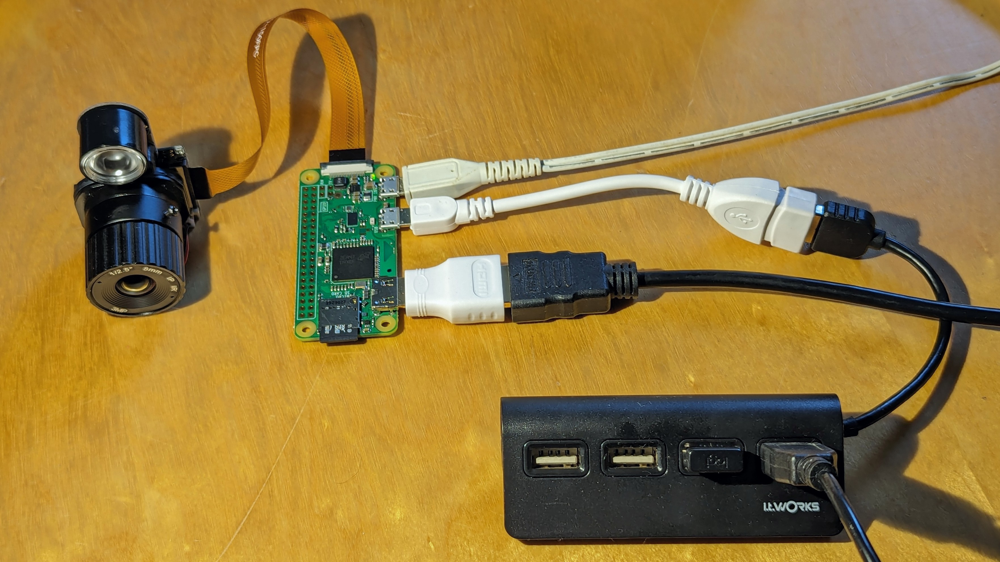

# pict

The Plant insect Interactions Camera Trap (PICT), is a DIY, low-cost, weather-resistant camera designed to be autonomous, energy efficient and modular. Its architecture is based on a Raspberry Pi single board computer.

This git repository aims at providing the resources to build a PICT from a Raspberry Pi Zero and the appropriate peripherals including a camera.

## Resources

The method is described in a paper in Method in Ecology and Evolution :
https://doi.org/10.1111/2041-210X.13618

A user manual is periodically updated and can be downloaded from:
https://doi.org/10.5281/zenodo.4139838

It is also provided in the [doc](doc/) folder.

## Build a prototype

### Hardware

- Raspberry Pi Zero board

- Micro SD card and adapter to your desktop computer (either micro SD-to-SD, either micro SD-to-USB)

- Raspberry Pi Camera "NoIR" with 1 IR LED.

- Camera flat cable. This should have a small side for the Raspberry Pi board and a larger side for the camera.

- Mini HDMI-to-HDMI adapter

- Micro USB-to-USB adapter

Note that mini HDMI-to-HDMI and micro USB-to-USB are commonly sold together as a Raspberry Pi Zero adapter kit.

- Micro-USB charger

- Multi-USB dispatcher, to which are connected a USB mouse and a USB keyboard

- Computer screen with a HDMI cable

### Flash the OS

From a desktop computer, install [Raspberry Pi Imager](https://raspberrypi.com/software). Connect the micro SD to the desktop computer using the relevant adapter. Using Raspberry Pi Imager, flash the OS to the SD card with the following parameters:

- Device = Raspberry Pi Zero

- OS = Raspberry Pi OS Legacy 32-bits. This is the default, recommanded one and the version name is Bullseye.

### Set up the Raspberry board

Once the SD card has been written, insert it within the Raspberry Pi Zero board. Connect to the board your screen (using the micro HDMI-to-HDMI adapter), your mouse and keyboard (using the micro USB-to-USB adapter, beware to use the "USB" port and not the "PWR" one), the camera (using the flat cable). Beware the camera flat cable is plugged on the right side, the IR LED should glow when it is properly plugged. Finally, power the board from the "PWR" micro USB port.



The next step is to parameterize the OS installation. It is easier to stick to English language as all documentation and help will be found in English. Provide the wifi ID and password at the installation step so that the software will be updated right ahead.

Once the OS is installed, the board launches as a regular desktop computer. If you use a non-qwerty keyboard, set it up as a first step. Go to the Raspberry starter (logo) / Preferences / Keyboard and mouse / Keyboard / Layout and select the appropriate layout.

The next important step is to enable the camera. Open the terminal, and access the Configuration pane:

```{bash}
sudo raspi-config
```

Select: 3. Interface options / I1. Legacy camera / yes.

Then Finish / yes to the reboot proposition.

Once the board is rebooted, open the terminal and prepare pict:

```{bash}
cd ~/
mkdir record
git clone https://github.com/almarch/pict.git 
``` 

To save energy, switch the bluetooth off from a right click on the blueetooth logo in the top right corner of the desktop interface.

### Switch to CLI (command line interface)

Running the desktop interface rquires a lot of resources. Therefore, we will disable the launch of the desktop interface at launch.

Go to the Raspberry starter (logo) / Preferences / Raspberry Pi Configuration / System. Select Boot: To CLI. From now on, the system boots in command line interface.

If you need to acces the desktop interface, for instance in order to preview your records or to use the board for another purpose, launch it from the CLI:

```{bash}
startx
```
 
### Register wifi networks

Configure the board so that it memorizes all wifi networks you may potentially connect it from. To do so, edit the WPA configuration file:

```{bash}
sudo nano /etc/wpa_supplicant/wpa_supplicant.conf
```

and add as many networks as needed. The configuration file should look like this:

```
ctrl_interface=DIR=/var/run/wpa_supplicant GROUP=netdev
update_config=1

network={
    ssid="My_Pro/Perso_Wifi_ID"
    psk="My_password"
    key_mgmt=WPA-PSK
    priority=1
    scan_ssid=1
}

network={
    ssid="My_mobile_phone_shared_Wifi_ID"
    psk="My_other_password"
    key_mgmt=WPA-PSK
    priority=2
    scan_ssid=1
}
```

Save, and reboot. The board should automatically connect to the registered networks when available.

## Connect with SSH

SSH-server should automatically be installed, if it's not the case install ssh-server:

```{bash}
sudo apt update
sudo apt install openssh-server
```

Enable SSH with systemctl:

```{bash}
sudo systemctl enable ssh
```

You can check is SSH is well enabled:

```{bash}
sudo systemctl status ssh
```

The next step is to collect your board IP adress:

```{bash}
ip a
```

The IP to use is the one in section 2: wlan, after "inet" and before "/... brd". The IP depends on the wifi network. If you need to switch for instance from a desktop wifi network to a smartphone shared connection, note both IP adresses.

You may connect to the board directly via SSH (from a Linux device), via [PuTTY](https://putty.org) (from a Windows device), or via [Termius](https://termius.com) (from an Android, Mac or Windows device).

Beware that the board is not reachable from the web, only in local connection. Therefore, both device (the board and the connecting device) should be connected on the same wifi network.

## Scale up

Now that we have a working prototype, the next step will be to clone it to as many PICT as needed.

The hardware of each PICT has to be built as described in the doc file.

The software can be cloned from one SD card to the other using (...).

## Post-hoc analysis

Post-hoc analysis can be achieved using the matlab script provided in the [src](src/) folder. 
